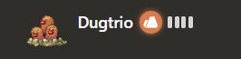
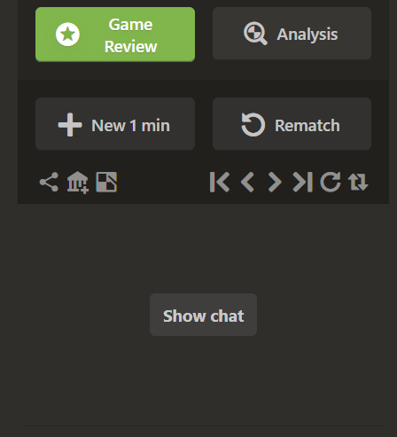
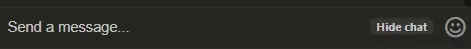

https://github.com/MikeBeloborodov/chess_com_pokemon_extension
# Chess.com Pokemon extension

- [About](#about)
- [Installation](#installation)
- [Screenshot](#screenshot)
- [Author](#author)

## About
This extension changes opponent name, avatar and country during the game on [chess.com](chess.com) to a pokemon from PokeAPI.
It also hides chat to let you concentrate more on the game.
Thanks to the github user [duiker101](https://github.com/duiker101) for Pokemon SVG icons.

## Installation

- Download .zip archive
- Extract
- Open Google Chrome -> Extensions
- Toggle "Developer mode" in the right corner
- Press "Load unpacked" button and choose the folder with extracted extension
- Press OK  

## Screenshot

## Author

- Github - [Mike Beloborodov](https://github.com/MikeBeloborodov)
- Frontend Mentor - [@MikeBeloborodov](https://www.frontendmentor.io/profile/MikeBeloborodov)