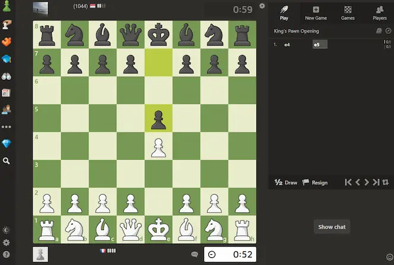

https://github.com/MikeBeloborodov/chess_com_zen_mode_addon
# Chess.com zen mode extension for Google Chrome

- [About](#about)
- [Installation](#installation)
- [Screenshot](#screenshot)
- [Author](#author)

## About
This extension hides chat component during the game on [chess.com](chess.com).

## Installation

- Download .zip archive
- Extract
- Open Google Chrome -> Extensions
- Toggle "Developer mode" in the right corner
- Press "Load unpacked" button and choose the folder with extracted extension
- Press OK 

## Screenshot

## Author

- Github - [Mike Beloborodov](https://github.com/MikeBeloborodov)
- Frontend Mentor - [@MikeBeloborodov](https://www.frontendmentor.io/profile/MikeBeloborodov)